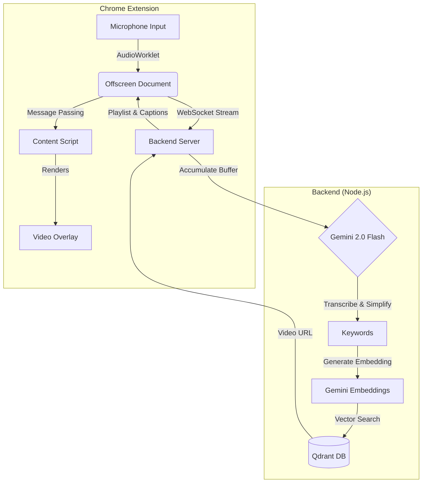

<div align="center">

# 👐 SignFlow
### Real-time AI Sign Language Interpreter for the Web

[](https://opensource.org/licenses/MIT)
[](https://nodejs.org/)
[](https://deepmind.google/technologies/gemini/)
[](https://qdrant.tech/)
[](https://developer.chrome.com/docs/extensions/mv3/)

<br />

**SignFlow** bridges the communication gap in online meetings by providing instant, automated American Sign Language (ASL) interpretation. 
Powered by **Google Gemini 2.0** and **Qdrant**, it listens to spoken audio, understands the context, and overlays the corresponding sign language video in real-time.

[View Demo](#-demo) • [Installation](#-installation) • [Architecture](#-architecture) • [Contributing](#-contributing)

</div>

---

## 🚀 Features

| Feature | Description |
| :--- | :--- |
| **🎙️ Real-time Audio Capture** | Captures meeting audio directly from the browser tab using **Chrome AudioWorklet**. |
| **🧠 Context-Aware AI** | Uses **Gemini 2.0 Flash** to transcribe, simplify, and extract key concepts from speech. |
| **🔍 Semantic Video Search** | Retrieves the most relevant sign language videos using **Vector Embeddings** and **Qdrant**. |
| **📺 Floating Overlay** | Displays a draggable, resizable video player with real-time captions on top of any website (Zoom, Meet, Teams). |
| **⚡ Low Latency** | Optimized pipeline for near-instant interpretation (Free Tier adjusted for rate limits). |

---

## 🏗️ Architecture



---

## 🛠️ Tech Stack

- **Frontend**: Chrome Extension Manifest V3, Vanilla JS, HTML5 Video, Web Audio API (AudioWorklet).
- **Backend**: Node.js, Express, WebSocket (`ws`).
- **AI/ML**: 
  - **STT & NLP**: Google Gemini 2.0 Flash (Experimental).
  - **Embeddings**: Google Gemini Text-Embedding-004.
- **Database**: Qdrant (Vector Database) for high-speed similarity search.
- **DevOps**: Docker, Docker Compose.

---

## 📦 Installation

### Prerequisites
- Node.js v18+
- Docker (for Qdrant)
- Google Gemini API Key

### 1. Clone & Setup Backend

```bash
git clone https://github.com/yourusername/signflow.git
cd signflow/backend

# Install dependencies
npm install

# Create .env file
echo "PORT=3000" > .env
echo "GEMINI_API_KEY=your_actual_api_key" >> .env
echo "QDRANT_URL=http://localhost:6333" >> .env
```

### 2. Start Services

You can run the full stack with Docker Compose:

```bash
# From the root directory
docker-compose up --build
```

Or run manually:

```bash
# Terminal 1: Start Qdrant
docker run -p 6333:6333 qdrant/qdrant

# Terminal 2: Start Backend
cd backend
npm start
```

### 3. Load Extension

1. Open Chrome and navigate to `chrome://extensions`.
2. Enable **Developer mode** (top right toggle).
3. Click **Load unpacked**.
4. Select the `extension` folder from this project.
5. **Grant Permissions**: A setup tab will open automatically. Click "Grant Microphone Access".

---

## 🎥 Usage

1. **Start the Backend**: Ensure your local server is running on port 3000.
2. **Join a Meeting**: Open Google Meet, Zoom, or any tab with audio.
3. **Activate SignFlow**:
   - Click the extension icon.
   - Click **"Start Listening"**.
4. **Watch**: The overlay will appear. As people speak, the corresponding sign language videos will play automatically.

> **Note**: Due to Gemini Free Tier limits, updates occur every ~4.5 seconds.

---

## 🔮 Roadmap

- [ ] **Avatar Generation**: Replace video retrieval with real-time 3D avatar generation for infinite vocabulary.
- [ ] **Multi-Language**: Translate Spanish/French audio to ASL.
- [ ] **Custom Vocabulary**: Allow users to upload their own sign videos.
- [ ] **Mobile App**: Standalone iOS/Android app for in-person translation.

---

## 🤝 Contributing

Contributions are welcome! Please read our [Contributing Guide](CONTRIBUTING.md) for details on our code of conduct, and the process for submitting pull requests.

1. Fork the Project
2. Create your Feature Branch (`git checkout -b feature/AmazingFeature`)
3. Commit your Changes (`git commit -m 'Add some AmazingFeature'`)
4. Push to the Branch (`git push origin feature/AmazingFeature`)
5. Open a Pull Request

---

## 📄 License

Distributed under the MIT License. See `LICENSE` for more information.

<div align="center">
  <sub>Built with ❤️ for Accessibility</sub>
</div>
